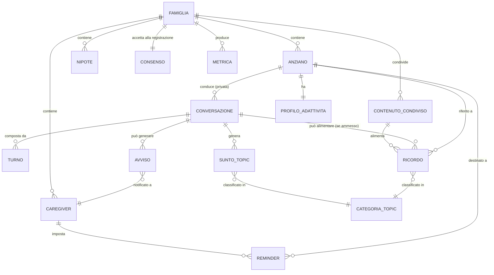

# 00 — Glossario e Domain Model

> Documento fondativo. Definisce il linguaggio condiviso (ubiquitous language) e il
> modello di dominio di STORIES. Tutti gli altri documenti (`01`–`06`, `spec.md`,
> `IMPLEMENTATION_PLAN.md`) usano i termini qui definiti.
>
> **Fonti**: pitch deck (`pitch_deck_no_video.pptx`), documento funzionale del
> workshop Boosha (`Workshop_Boosha_LUGAGO_2026`), thread email "Re: Workshop AI"
> con Boosha (giu–lug 2026).

---

## 1. Visione in una frase

STORIES è un'app **adattiva** che sostiene gli **anziani** e le loro **famiglie**
rafforzando **memoria**, **connessione emotiva** e **benessere quotidiano**, tramite
**conversazioni ingaggianti** tra l'anziano e un **amico virtuale** basato su AI, alimentate da una **memoria affettiva** costruita dai contenuti condivisi dalla famiglia.

---

## 2. Personas

| Persona | Ruolo nel sistema | Bisogno primario (valore atteso) |
|---|---|---|
| **Anziano** | Utente principale, interagisce **a voce** con l'amico virtuale | Condurre conversazioni **interessanti e ingaggianti**, calibrate sulle proprie capacità; sentirsi "coccolato", in uno spazio privato e sicuro |
| **Figlio/a** (caregiver primario) | Alimenta la memoria affettiva, monitora, imposta reminder; interagisce **via Telegram** | Avere uno strumento che lo/la aggiorna sullo **stato psico-fisico** del genitore e lo/la sollecita a condividere pezzi di vita quotidiana, potendo verificare i **topic** trattati (non i contenuti) |
| **Nipote** | Condivide esperienze/foto con il/la nonno/a | Rendere il/la nonno/a **più presente** nella vita quotidiana; condividere momenti |
| **Investitore** | Stakeholder, **non** utente runtime | Vedere un **utilizzo crescente** dell'app da parte di tutti (metriche di adoption) |

Personas/stakeholder **non runtime** rilevanti per la roadmap (non MVP): **RSA/Case
di cura** (dashboard dedicata, R2), **medici/operatori sanitari** (R3), **Advisory
Board** (neurologia, psicoterapia, geriatria), **DPO** e **Comitato Etico**.

> **Principio trasversale — Adattività**: l'anziano è al centro. Tono, velocità del
> parlato, lessico e modalità di interazione dell'amico virtuale devono adattarsi alle
> **capacità lessicali e cognitive** del singolo anziano. L'anziano non deve mai
> provare frustrazione.

---

## 3. Glossario (Ubiquitous Language)

| Termine | Definizione |
|---|---|
| **Amico virtuale** | Agente conversazionale AI con cui l'anziano dialoga a voce. Empatico, non clinico, non giudicante. Deve dichiarare di essere un'AI **all'inizio e ogni tanto**. |
| **Famiglia** / **Contenitore famiglia** | Unità di isolamento dei dati (tenant). Tutti i contenuti, i profili e le conversazioni restano **confinati alla famiglia**. |
| **Segregazione per famiglia** | Isolamento rigoroso dei dati tra famiglie diverse. Nel PoC realizzato **a livello di dispositivo**; nell'architettura target **a livello di contenitore famiglia** lato server. |
| **Codice di accesso** | Credenziale che identifica una famiglia (es. `stories-6a20be89`). Il sistema riconosce con quale codice si è entrati (utile anche per instradare le notifiche). |
| **Memoria affettiva** | Repository di **ricordi** (testo e immagini condivise) da cui l'amico virtuale attinge per creare conversazioni ingaggianti. **Mai** contiene audio; **mai** categorie escluse dai guardrail. |
| **Ricordo (MemoryItem)** | Singola unità di memoria: un contenuto condiviso dalla famiglia (foto/testo) o un'informazione emersa in conversazione e ammessa dalle regole di memorizzazione, classificata per **topic**. |
| **Topic** | Argomento di una conversazione o di un ricordo (es. calcio, primo lavoro, un amore). Chiave del recupero della memoria "per argomento". |
| **Categoria topic** | Raggruppamento di topic con associato **livello di cautela** e **azione sulla memoria** (vedi `02-guardrail-safety-policy.md`). Distinta in **IN** (di interesse) e **OUT/sensibili** (da evitare o trattare con cautela). |
| **Sunto per topic** | Riassunto strutturato che l'AI genera **a ogni conversazione**, filtrato dalle regole dei temi sensibili. È **ciò che la famiglia può vedere** (la lista/sintesi dei topic, **non** il contenuto integrale della conversazione). |
| **Guardrail** | Regole che vincolano il comportamento dell'AI: temi da non toccare o da trattare con cautela, frasi di rifiuto, domande proattive da evitare, regole di memorizzazione. |
| **Conversazione privata** | Le conversazioni dell'anziano con l'amico virtuale sono **private**: non accessibili alla famiglia. La famiglia riceve solo i **sunti per topic** e gli avvisi. |
| **Adattività** | Capacità del sistema di regolare parametri di interazione (velocità del parlato, lessico, tono, lunghezza delle frasi) sulle capacità dell'anziano. |
| **Emozione dichiarata** | Emozione **espressa a parole** dall'anziano (es. "sono in ansia", "oggi sono sereno"). È l'**unico** segnale emotivo ammesso: **nessun** riconoscimento emotivo biometrico/vocale (per l'MVP). |
| **Avviso alla famiglia** | Notifica generata quando emerge un **disagio dichiarato** persistente o un **segnale di tutela** (safeguarding). |
| **Emergenza / "Richiesta di aiuto"** | Situazione in cui l'anziano esprime un bisogno urgente (es. "non mi sento bene"): attiva una notifica immediata ai destinatari configurati. |
| **Safeguarding** | Policy separata per segnali di abuso/trascuratezza/coercizione **verso** l'anziano: non vanno nascosti alla famiglia. |
| **Reminder** | Promemoria per l'anziano (pillole, appuntamenti) impostato dalla famiglia, con **frequenza** di riproduzione e raccolta di **feedback** sull'avvenuta ricezione. |
| **Contenuto condiviso** | Foto/video/audio/testo inviati dalla famiglia (via Telegram) per alimentare la memoria affettiva. |
| **Trascrizione (STT)** | Conversione dell'audio dell'anziano in testo. **Vincolo**: l'audio **non** viene conservato sui server (target: trascrizione on-device; MVP: trascrizione lato server con audio scartato subito). |
| **Sintesi vocale (TTS)** | Conversione del testo dell'amico virtuale in voce, con velocità regolabile. |
| **Consenso** | Accettazione di clausole GDPR e del modulo Emergenza (audio/video) alla **prima registrazione**, con possibilità di **opt-out** su determinati moduli. |
| **PoC / semilavorato** | Prototipo funzionante realizzato prima del workshop, da testare con anziani e mostrare a investitori. |

---

## 4. Modello di dominio (entità e relazioni)

### 4.1 Entità principali

- **Famiglia** — tenant e confine di isolamento. Attributi: id, codice/i di accesso,
  stato consenso, canale famiglia (Telegram chat associata).
- **Anziano** — profilo dell'utente principale. Attributi: id, nome, interessi
  (topic IN), **profilo di adattività** (velocità parlato, lessico, ecc.),
  eventuali particolarità (udito/vista/dialetto) utili a tarare il riconoscimento vocale.
- **Caregiver (Figlio/a)** e **Nipote** — membri della famiglia che condividono
  contenuti e (per il caregiver) monitorano e impostano reminder.
- **Conversazione** — sessione di dialogo anziano ↔ amico virtuale, **privata**.
  Composta da **Turni** (messaggi). Non condivisa integralmente con la famiglia.
- **Turno** — singolo scambio (input anziano trascritto / risposta AI). L'audio non è persistito.
- **Sunto per topic** — riassunto strutturato prodotto a fine conversazione,
  filtrato dai guardrail; **visibile alla famiglia**.
- **Ricordo (MemoryItem)** — unità della memoria affettiva; testo o immagine;
  classificato per **Categoria topic**; recuperabile per argomento (retrieval).
- **Contenuto condiviso** — media inviato dalla famiglia; può generare uno o più ricordi
  (es. una foto con "aiuti all'interpretazione").
- **Categoria topic** — vedi tassonomia in `02`. Porta con sé livello di cautela e
  azione sulla memoria.
- **Reminder** — promemoria per l'anziano con frequenza e feedback.
- **Avviso** — notifica alla famiglia (disagio dichiarato persistente, safeguarding, emergenza).
- **Consenso** — record di accettazione GDPR + Emergenza, con opt-out per moduli.
- **Profilo di adattività** — parametri di interazione personalizzati per l'anziano.
- **Metrica** — misure di successo per persona (vedi `01` §metriche).

### 4.2 Invarianti di dominio (regole sempre vere)

1. **Nessun audio persistito.** In nessuna entità viene conservata la traccia audio;
   si conserva al più la **trascrizione testuale**.
2. **Isolamento per famiglia.** Ogni Ricordo, Conversazione, Sunto e Contenuto
   appartiene a esattamente una Famiglia e non è mai visibile ad altre.
3. **Privatezza delle conversazioni.** Il contenuto integrale di una Conversazione non
   è mai esposto alla famiglia; solo i **Sunti per topic** e gli **Avvisi** lo sono.
4. **Filtro di memorizzazione.** Un Ricordo può essere creato **solo** se la relativa
   Categoria topic lo consente (vedi `02`). Le categorie in blacklist non generano
   mai Ricordi.
5. **Emozione solo se dichiarata.** Nessuna inferenza emotiva biometrica; lo stato
   emotivo è dato solo da quanto l'anziano dichiara a parole (MVP).
6. **Trasparenza.** L'amico virtuale dichiara di essere un'AI all'inizio e periodicamente.

---

## 5. Contesti (bounded contexts) — anticipazione architetturale

Per orientare i documenti successivi, il dominio si articola in aree coese:

- **Conversazione & AI** — dialogo, adattività, generazione sunti, applicazione guardrail.
- **Memoria affettiva** — ingestion contenuti, classificazione per topic, retrieval.
- **Canale famiglia** — Telegram: condivisione contenuti, sunti, avvisi, reminder.
- **Sicurezza & Compliance** — consenso, guardrail, emergenza, safeguarding, audit.
- **Osservabilità & Metriche** — misure di adoption e qualità dell'interazione.

Il dettaglio tecnico di ciascun contesto è nei documenti `03`–`06`.
