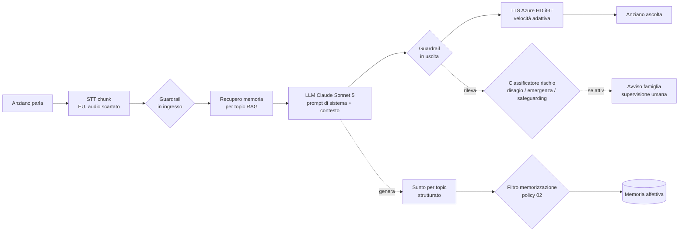

# 04 — Conversation & AI Design

> Come si comporta l'**amico virtuale**: architettura del prompt, adattività, uso della
> memoria affettiva, generazione dei sunti per topic, applicazione dei guardrail.
>
> Dipende da: `00` (dominio), `01` (RF-01..11, RF-24, RF-36..39), `02` (guardrail),
> `03` (scelte tecniche: pipeline modulare, Claude Sonnet 5, memoria per topic).

---

## 1. Obiettivo di design

L'anziano deve **sentirsi coccolato**: conversazioni ingaggianti sui suoi interessi,
comunicazione fluida ed empatica, calibrate sulle sue capacità lessicali e di interazione.
Il successo si misura sull'**ingaggio** (tempo in conversazione, ritorno spontaneo) e
sulla **comprensione reciproca** (poche richieste di ripetere, poche incomprensioni).

---

## 2. Pipeline conversazionale (runtime)

Architettura **modulare** (ADR-0006), con testo intermedio ispezionabile:



**Nota latenza**: STT, LLM e TTS lavorano in **streaming** per stare nel budget ~0,8–1,5 s
(`03` §8); barge-in gestito dall'orchestratore.

---

## 3. Architettura del prompt di sistema

Il prompt di sistema dell'amico virtuale è **composto a strati**, versionato e separato
dal codice (RNF-17). Strati:

1. **Identità & tono** — amico virtuale caloroso, paziente, non giudicante; parla italiano
   semplice; **dichiara di essere un'AI** all'inizio e periodicamente (RF-04, `02` §8).
2. **Profilo dell'anziano** — nome, interessi (topic IN), parametri di adattività
   (§4), particolarità note (udito/vista/dialetto). Iniettato a runtime.
3. **Contesto di memoria** — ricordi rilevanti recuperati per topic (§5), con provenienza
   (condiviso dalla famiglia / emerso in conversazione).
4. **Guardrail comportamentali** — regole §1–§4 di `02`: domande da evitare, frasi di
   rifiuto, empatia non clinica, no persuasione/dipendenza.
5. **Istruzioni di output strutturato** — a fine turno/sessione, produrre il **sunto per
   topic** in formato strutturato (§6) tramite tool/JSON nativo di Claude.

> **Principio**: il prompt di sistema è il **livello 1** di enforcement dei guardrail; da
> solo **non basta** (benchmark GrandGuard, `03` §2). I livelli 2 (filtro memoria) e 3
> (classificatore rischio) sono componenti separati e obbligatori.

---

## 4. Adattività (RF-09, RF-10, RF-11)

Un **Profilo di adattività** per anziano, pilotabile e memorizzato, con parametri:

| Parametro | Range/valori (indicativi, da tarare) | Effetto |
|---|---|---|
| **Velocità del parlato** (TTS) | lento / medio / normale (SSML `prosody rate`) | Intelligibilità; requisito RNF-9 originale |
| **Lessico** | semplice / medio | Scelta di parole e complessità sintattica nel prompt |
| **Lunghezza frasi** | breve / media | Frasi corte per ridurre carico cognitivo |
| **Tono** | caldo / brioso / calmo | Registro emotivo |
| **Pause** | brevi / ampie (SSML `break`) | Tempo di elaborazione per l'anziano |

**Come si tara.** MVP: valori impostati in onboarding dal caregiver + aggiustamento
manuale. Segnali osservabili per suggerire aggiustamenti (non automatismi invasivi):
frequenza di "richieste di ripetere" e incomprensioni (RF-36). **Cautela**: rallentare
troppo degrada la prosodia (`03` §4) → soglia validata con utenti reali.

---

## 5. Memoria affettiva & recupero per topic (RF-05, RF-06, RF-15)

**Pattern** (da `03` §5): episodica → distillazione → semantica, con granularità
turno → sessione → **topic**.

- **Scrittura**: a ogni conversazione l'AI genera **sunti strutturati per topic**; il
  **filtro di memorizzazione** (`02` §9 liv. 2) decide cosa scrivere, applicando le
  "Azioni sulla memoria" della tabella `02` §4 (blacklist, non-memorizzazione,
  generalizzazione). **Mai** audio; **mai** categorie escluse.
- **Contenuti condivisi**: foto/testo dalla famiglia entrano come **ricordi**, classificati
  per topic, eventualmente con "aiuti all'interpretazione" (RF-12).
- **Lettura (RAG)**: all'inizio/durante la conversazione, recupero dei ricordi rilevanti
  **per argomento** ("se si parla di calcio, si ricostruisce il contesto sui topic di
  calcio"). Retrieval vettoriale filtrato per `family_id` + `topic`.
- **Proposta in differita** (RF-13): le foto condivise vengono riproposte in vari momenti
  della giornata per stimolare il ricordo **senza generare frustrazione** (se l'anziano
  non riconosce, l'AI accompagna con un racconto — cfr. caso "Stimolazione della memoria"
  del pitch).

---

## 6. Sunto per topic (contratto dati) (RF-05, RF-24)

Prodotto a fine conversazione, **filtrato dai guardrail**, è ciò che la **famiglia vede**
(lista/sintesi dei topic, **non** il contenuto integrale — RF-24, RF-30).

Struttura logica (schema indicativo, non vincolante per l'implementazione):

```json
{
  "conversation_id": "…",
  "family_id": "…",
  "timestamp": "…",
  "topics": [
    {
      "categoria": "Interessi personali",
      "topic": "calcio",
      "sintesi_breve": "Ha parlato con piacere della partita di ieri.",
      "memorizzabile": true
    }
  ],
  "segnali": {
    "disagio_dichiarato": false,
    "emergenza": false,
    "safeguarding": false,
    "solitudine_non_clinica": false
  },
  "metriche_turno": {
    "durata_s": 0,
    "richieste_ripetere": 0,
    "incomprensioni_ai": 0,
    "incomprensioni_utente": 0
  }
}
```

- I campi `segnali.*` alimentano il **classificatore di rischio** (§7) e, se attivi,
  gli avvisi alla famiglia (con supervisione umana).
- Le `metriche_turno` alimentano la vista "Come sta andando" (RF-39) e le metriche di
  successo (RF-36..38).
- Nessun campo contiene **contenuto sensibile** delle categorie in blacklist.

---

## 7. Classificatore di rischio ed escalation (RF-25, RF-26, RF-27)

Livello 3 di enforcement (`02` §9). Opera sul **testo** (non su biometria):

- **Disagio dichiarato persistente** → avviso famiglia (`02` §6), senza indagare oltre.
- **Emergenza / "Richiesta di aiuto"** → notifica immediata + testo di conferma
  all'anziano (`02` §5). Priorità: **niente falsi positivi** (RNF-15).
- **Safeguarding** (abuso/trascuratezza/coercizione verso l'anziano) → policy separata
  (`02` §7), non nascondere alla famiglia.
- **Solitudine non clinica** → gestione empatica **senza** protocollo di emergenza.

Ogni escalation è **validata da un umano** (familiare) e **loggata** in modo immutabile
(AI Decision Log, RNF-09; dettaglio in `05`).

---

## 8. Ricerca esterna controllata

Per alcuni temi (es. opinioni politiche trattate come fatti storici) l'AI **può cercare
notizie su internet e riportare solo quanto trovato, citando la fonte** (`02` §4, riga
"Opinioni politiche"). Funzione opzionale, disattivabile, mai usata per esprimere giudizi.

---

## 9. Valutazione della qualità conversazionale

Non esistono benchmark pubblici su empatia in italiano con anziani (`03` §2). → Costruire
un **set di valutazione interno**:

- Rubric qualitativa (calore, chiarezza, aderenza ai guardrail, adattività percepita).
- A/B test controllati su prompt/parametri.
- Feedback soggettivo dei tester (3 domande secche: la conversazione ingaggia? la voce è
  chiara? torneresti a usarla?) — allineato al suggerimento Boosha nel thread.
- Lettura congiunta con le metriche oggettive (RF-36..39).

---

## 10. Cosa resta da definire al workshop

- Testo esatto delle **frasi trigger di emergenza**, del **messaggio di conferma** e dei
  **destinatari/canali** per famiglia (RF-26).
- Valori numerici definitivi dei **parametri di adattività** (RF-11).
- Primo caso concreto **foto con aiuti all'interpretazione** (RF-12) — da co-progettare.
- Set di valutazione interno e soglie di qualità.
