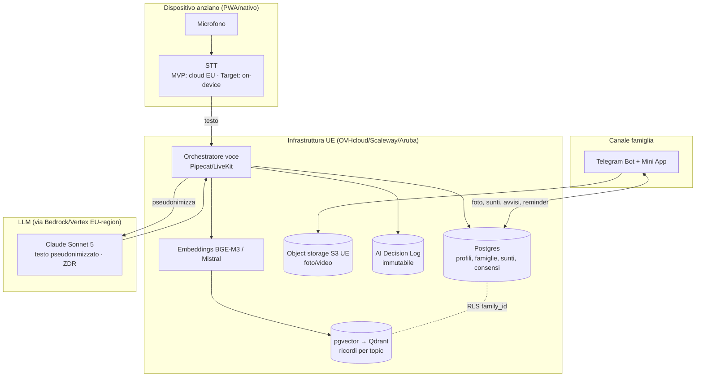

# 05 — Data & Privacy Architecture

> Dove vivono i dati, come fluiscono, quanto si conservano, e come questo mappa su GDPR ed
> EU AI Act. Traduce in architettura i vincoli di `02` (guardrail) e `03` §7 (compliance).
>
> **Non** è parere legale: la classificazione AI Act, la base giuridica e i contratti
> vanno validati da legale/DPO (come previsto per il workshop).

---

## 1. Principi architetturali di privacy

1. **Privacy & minimizzazione by design** (RNF-02): si memorizza il minimo indispensabile.
2. **Audio mai persistito** (RNF-01): solo trascrizione transitoria.
3. **Isolamento per famiglia** (RNF-03): ogni dato appartiene a una sola famiglia.
4. **Residenza UE** (RNF-05): storage, DB e orchestrazione in UE.
5. **Conversazioni private** (RNF-06): alla famiglia solo sunti per topic e avvisi.
6. **Trasferimento LLM minimizzato**: al provider LLM va **solo testo pseudonimizzato**,
   sotto DPA/SCC e (target) Zero Data Retention.

---

## 2. Classi di dato e collocazione

| Classe di dato | Esempio | Dove risiede | Persistenza |
|---|---|---|---|
| **Audio grezzo** | voce dell'anziano | in transito → STT | **Mai persistito** (scartato subito) |
| **Trascrizione** | testo del turno | orchestrazione UE | Transitoria; non conservata oltre l'elaborazione (MVP) |
| **Sunto per topic** | sintesi filtrata | DB relazionale UE | Conservata (memoria semantica), pseudonimizzata |
| **Ricordo / MemoryItem** | testo + embedding | DB relazionale + vettoriale UE | Conservata, filtrata dai guardrail |
| **Contenuto condiviso** | foto/video | object storage S3 UE | Conservata (solo immagini/testo, mai audio) |
| **Profilo anziano/famiglia** | nome, preferenze, adattività | DB relazionale UE | Conservata |
| **Consenso** | accettazioni GDPR/Emergenza | DB relazionale UE | Conservata (prova) |
| **Avvisi / escalation** | disagio, emergenza, safeguarding | DB + AI Decision Log | Conservata (audit immutabile) |
| **Metriche** | tempo, ripetizioni, DAU | DB analytics UE | Aggregata/pseudonimizzata |
| **Testo → LLM** | prompt + contesto | provider LLM (via Bedrock/Vertex EU) | ZDR (target) / retention 7gg (Anthropic default) |

---

## 3. Architettura target (post-workshop)

**Segregazione**: `family_id` come chiave di tenancy; **Row-Level Security** Postgres
(`FORCE ROW LEVEL SECURITY`) + filtro `family_id` obbligatorio su ogni query vettoriale,
verificati da test di isolamento automatici (`03` §5).

---

## 4. Stato PoC vs target (segregazione dati)

| Aspetto | PoC attuale (pre-workshop) | Target |
|---|---|---|
| Dati personali sul server | **Zero** (tutto sul dispositivo) | DB/vettoriale/object storage UE, segregati per famiglia |
| Segregazione | A livello di **dispositivo** | A livello di **contenitore famiglia** (multi-device) |
| Sincronizzazione multi-device | Assente | Prevista (dati segregati per famiglia) |
| Motivazione | Massima prudenza GDPR finché il consenso non è definito col legale | Consenso definito → server EU con memoria persistente |

> Il PoC genera **già** i sunti strutturati per topic (il "cosa memorizzare" esiste ed è
> filtrato dalle regole di `02`); il workshop definisce il "**dove e come**" conservarli.

---

## 5. Cifratura & gestione chiavi (RNF-04)

- **In transito**: TLS 1.3 ovunque.
- **A riposo**: cifratura dello storage (obiettivo AES-256); chiavi gestite in UE.
- **Obiettivo target**: cifratura e2e dove praticabile; pseudonimizzazione dei sunti.

---

## 6. Retention & cancellazione

| Dato | Retention (indicativa, da confermare col legale) |
|---|---|
| Audio | 0 (scartato immediatamente) |
| Trascrizione grezza | Transitoria (non oltre l'elaborazione, MVP) |
| Sunti per topic / ricordi | Finché serve la finalità (memoria affettiva), con cancellazione su richiesta |
| Log conversazione | Breve |
| Segnali di benessere aggregati | Più lunga ma **pseudonimizzata** |
| Consensi & Decision Log | Conservati come prova/audit |

- **Diritti dell'interessato**: cancellazione per famiglia (GDPR-delete: in Qdrant per
  shard/tenant; in pgvector per `family_id`); export su richiesta.
- **Data breach**: runbook notifica **72h** (Art. 33) + comunicazione agli interessati
  (Art. 34), con template dedicati per familiari/caregiver.

---

## 7. Mappatura compliance (sintesi operativa)

| Requisito normativo | Implementazione in STORIES | Rif. |
|---|---|---|
| **AI Act Art. 50** (trasparenza) | Disclosure "sono un'AI" all'inizio e periodicamente | `02` §8, `04` §3 |
| **AI Act Art. 5** (no sfruttamento vulnerabilità) | No dark pattern, no nudging su fragilità, no dipendenza | `02` §1 |
| **AI Act — no emotion recognition** | Emozione solo se dichiarata a parole | `02` §1, RF-07 |
| **AI Act Art. 6(4)** (classificazione) | Valutazione documentata "limited risk"; profilazione limitata a segnali dichiarati | `03` §7 |
| **GDPR consenso** | Onboarding in linguaggio semplice + co-consenso familiare | RF-34, `03` §7 |
| **GDPR Art. 9** (dati particolari) | Guardrail + non persistenza attributi inferiti | `02`, §2 |
| **GDPR minori (nipoti)** | Minimizzazione; consenso da 14 anni (IT) | `03` §7 |
| **GDPR Art. 35 (DPIA)** | DPIA prima del lancio (soggetti vulnerabili + IA) | `03` §7 |
| **GDPR Art. 33/34** | Runbook data breach 72h | §6 |
| **Governance** | DPO + Comitato Etico; AI Decision Log; audit | RNF-09/10 |
| **Trasferimenti extra-UE (LLM)** | DPA+SCC+ZDR; pseudonimizzazione; piano B EU-hosted | `03` §7 |

---

## 8. Canale famiglia — nota di compliance (Telegram)

Telegram non offre garanzia di residenza UE né DPA pubblico (`03` §6). Misure:

- **Minimizzazione**: nel canale famiglia **niente dati sanitari** né categorie sensibili.
- **Informativa GDPR** chiara sul trattamento extra-UE del canale (Art. 13).
- **Contenuti sensibili** restano nell'infrastruttura UE, non nel canale.
- **Exit strategy**: canale UE-hosted se il prodotto scala (ADR-0007).

---

## 9. Punti aperti per il legale/DPO (workshop)

- Testo definitivo di consenso e informativa; flusso di co-consenso.
- Conferma classificazione AI Act e necessità/estensione DPIA (ed eventuale FRIA).
- DPA + SCC + richiesta ZDR con il provider LLM; verifica regione di **inferenza** (non
  solo storage) di ogni fornitore.
- Policy di safeguarding quando il sospetto coinvolge un familiare.
- Tempi di retention definitivi.
