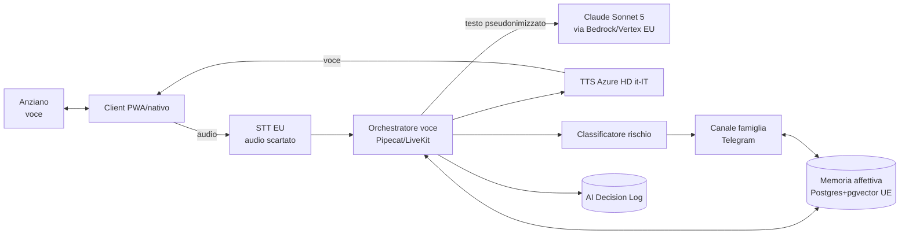

# STORIES — Documento di Specifiche (spec.md)

> **Ricordi che uniscono.** Un'app adattiva per supportare gli anziani e le loro
> famiglie, rafforzando memoria, connessione emotiva e benessere quotidiano.
>
> Documento di specifiche **consolidato** (visione di prodotto completa). Sintetizza e
> collega i documenti di dettaglio in `docs/`. Versione: **1.0 (pre-workshop, luglio 2026)**.

---

## Indice

1. [Introduzione e visione](#1-introduzione-e-visione)
2. [Personas e valore](#2-personas-e-valore)
3. [Ambito (scope): visione completa e MVP](#3-ambito-scope-visione-completa-e-mvp)
4. [Requisiti funzionali](#4-requisiti-funzionali)
5. [Requisiti non funzionali](#5-requisiti-non-funzionali)
6. [Guardrail e sicurezza](#6-guardrail-e-sicurezza)
7. [Architettura di sistema](#7-architettura-di-sistema)
8. [Modello dati e privacy](#8-modello-dati-e-privacy)
9. [Compliance (GDPR & EU AI Act)](#9-compliance-gdpr--eu-ai-act)
10. [Metriche di successo](#10-metriche-di-successo)
11. [Roadmap di prodotto](#11-roadmap-di-prodotto)
12. [Punti aperti](#12-punti-aperti)
13. [Riferimenti](#13-riferimenti)

---

## 1. Introduzione e visione

STORIES crea **conversazioni interessanti** tra l'anziano e un **amico virtuale** basato su
AI. La famiglia alimenta una **memoria affettiva** condividendo foto, video e momenti di
vita quotidiana; da questa memoria l'AI attinge per conversazioni ingaggianti, **calibrate
sulle capacità lessicali e di interazione** dell'anziano. L'anziano deve **sentirsi
coccolato**. Non è solo un'app: è un **ponte emotivo tra le generazioni**.

**Fondamento**: studi neurologici indicano che la memoria si rafforza quando entrano in
gioco le **emozioni**. STORIES stimola la memoria emotiva, rafforza i legami familiari e
riduce il senso di colpa nei caregiver facilitando il contatto umano.

Questo documento traduce i requisiti funzionali in scelte tecniche e funzionali, e fa da
riferimento per lo **sviluppo completo** dell'applicazione, con un **percorso MVP-first**.

---

## 2. Personas e valore

| Persona | Interazione | Valore atteso |
|---|---|---|
| **Anziano** | Voce, con l'amico virtuale | Conversazioni interessanti e ingaggianti, calibrate; spazio privato e sicuro; sentirsi coccolato |
| **Figlio/a** (caregiver) | Telegram | Aggiornamento sullo stato psico-fisico del genitore; sollecito a condividere; verifica dei **topic** (non dei contenuti) |
| **Nipote** | Telegram | Rendere il nonno più presente; condividere momenti |
| **Investitore** | — | Utilizzo crescente da parte di tutti (adoption) |

Dettaglio in [`docs/00`](docs/00-glossario-e-domain-model.md).

---

## 3. Ambito (scope): visione completa e MVP

Questo `spec.md` descrive la **visione completa**. L'[implementation plan](IMPLEMENTATION_PLAN.md)
sequenzia lo sviluppo **partendo dall'MVP** (il semilavorato funzionante da testare con
anziani e mostrare a investitori).

- **MVP** — conversazione empatica voce-first con guardrail, sunti per topic visibili alla
  famiglia, canale Telegram, avvisi/emergenza, metriche base. (Allineato al PoC esistente.)
- **Oltre l'MVP** — memoria affettiva persistente (foto con aiuti all'interpretazione,
  RAG per topic), comunicazione asincrona anziano↔famiglia, reminder, multi-dispositivo,
  poi RSA e integrazione medicale/VAD.

Lo **stato attuale** (PoC pre-workshop, già online): web app + bot Telegram, LLM Claude,
segregazione a livello di dispositivo, guardrail e sunti per topic già implementati.

---

## 4. Requisiti funzionali

Registro completo e tracciabile in [`docs/01`](docs/01-requirements-register.md). Sintesi
per area (ID = riferimento al registro):

- **Conversazione & AI** (RF-01..08): dialogo vocale empatico in italiano sui topic di
  interesse; trasparenza AI; **sunto per topic** a ogni conversazione; uso della memoria
  affettiva; emozione solo se dichiarata; gestione temi sensibili.
- **Adattività** (RF-09..11): l'app adegua modalità, **velocità del parlato**, lessico.
- **Memoria affettiva** (RF-12..15): foto con aiuti all'interpretazione; proposta in
  differita senza frustrazione; contenuti della famiglia e del nipote.
- **Comunicazione asincrona** (RF-16..20): audio e testo bidirezionali, trascrizione.
- **Reminder** (RF-21..23): promemoria con frequenza e feedback; silenziamento orari.
- **Monitoraggio, avvisi, emergenza** (RF-24..27): sunto dei topic alla famiglia (non i
  contenuti); avviso su disagio dichiarato; **"Richiesta di aiuto"**; safeguarding.
- **Identità & segregazione** (RF-28..31): riconoscimento anziano; contenuti confinati
  alla famiglia; conversazioni private; codice di accesso.
- **Canale famiglia** (RF-32..33): Telegram; notifiche gestibili per famiglia.
- **Onboarding & consenso** (RF-34..35): GDPR + Emergenza alla registrazione; opt-out.
- **Metriche** (RF-36..39): per anziano, caregiver, investitore; vista "Come sta andando".

---

## 5. Requisiti non funzionali

Dettaglio in [`docs/01` §2](docs/01-requirements-register.md). Sintesi:

- **Privacy & sicurezza** (RNF-01..06): **audio mai persistito**; minimizzazione;
  **isolamento per famiglia**; cifratura; **residenza UE**; conversazioni private.
- **Compliance** (RNF-07..10): GDPR, EU AI Act "utente fragile", AI Decision Log,
  governance (DPO, Comitato Etico).
- **Accessibilità & adattività** (RNF-11..13): voce-first senza input manuali complessi;
  linguaggio accessibile; consensi semplificati.
- **Prestazioni & affidabilità** (RNF-14..16): bassa latenza; allarmi reali, non falsi
  positivi; fallback LLM.
- **Portabilità & evoluzione** (RNF-17..19): layer LLM/voce astratto; multi-dispositivo;
  predisposizione RSA/medicale.

---

## 6. Guardrail e sicurezza

STORIES si rivolge a un **utente fragile** e tratta dati potenzialmente di categoria
particolare. La policy completa (tassonomia temi sensibili × cautela × azione sulla
memoria, domande proattive da evitare, protocollo emergenza, safeguarding, trasparenza) è
in [`docs/02`](docs/02-guardrail-safety-policy.md).

**Enforcement a tre livelli** (obbligatori — i safety layer nativi degli LLM sono
insufficienti sui rischi anziani):

1. **Prompt di sistema** (comportamento, frasi di rifiuto, domande da evitare).
2. **Filtro di memorizzazione** pre-scrittura (blacklist, non-memorizzazione,
   generalizzazione; mai audio).
3. **Classificatore di rischio** (disagio/emergenza/safeguarding) con **supervisione
   umana** e log immutabile.

---

## 7. Architettura di sistema

Pipeline **modulare** voce-first (dettaglio in [`docs/04`](docs/04-conversation-ai-design.md)
e [`docs/06`](docs/06-adr/README.md)):

Scelte tecniche motivate nello [studio di fattibilità](docs/03-feasibility-and-tech-study.md)
e formalizzate negli [ADR](docs/06-adr/README.md):

| Layer | MVP | Target |
|---|---|---|
| LLM | Claude Sonnet 5 via Bedrock/Vertex EU (+ Haiku fallback) | Routing Opus per casi delicati; Mistral (sovranità) |
| STT | Deepgram Nova-3 EU (audio scartato) | On-device (Apple SpeechAnalyzer / Whisper-Voxtral) |
| TTS + voce | Pipeline modulare + Azure HD it-IT | ElevenLabs v3 |
| Memoria | Postgres + pgvector UE; embeddings BGE-M3/Mistral | Qdrant UE |
| Client | PWA Next.js (push-to-talk) | Nativo Flutter |
| Canale famiglia | Telegram Bot + Mini App | + exit strategy UE |
| Infra | Cloud UE (OVHcloud/Scaleway/Aruba) | AWS Eu. Sovereign / ISO 27701 |

---

## 8. Modello dati e privacy

Entità e invarianti in [`docs/00`](docs/00-glossario-e-domain-model.md); architettura dei
dati, data-flow, retention e cifratura in [`docs/05`](docs/05-data-privacy-architecture.md).

**Invarianti chiave**: nessun audio persistito · isolamento per famiglia (`family_id` +
RLS) · conversazioni private (alla famiglia solo sunti e avvisi) · filtro di
memorizzazione secondo i guardrail · residenza UE.

---

## 9. Compliance (GDPR & EU AI Act)

Dettaglio in [`docs/05` §7](docs/05-data-privacy-architecture.md) e
[`docs/03` §7](docs/03-feasibility-and-tech-study.md). Punti cardine:

- **Trasparenza AI Act Art. 50** (dichiarare che è un'IA) — pienamente applicabile dal
  2 agosto 2026.
- **No sfruttamento delle vulnerabilità** (Art. 5); **no emotion recognition** biometrico
  (emozione solo se dichiarata).
- Classificazione **"limited risk"** documentata (Art. 6(4)), con profilazione limitata a
  segnali dichiarati; da rivedere se il prodotto evolve verso funzioni sanitarie.
- **GDPR**: consenso in linguaggio semplice + co-consenso familiare; DPIA prima del
  lancio; audio mai conservato; runbook data breach 72h.
- **Trasferimenti extra-UE (LLM)**: DPA+SCC+ZDR, pseudonimizzazione, piano B EU-hosted.

> Non è parere legale: da validare con legale/DPO (previsto al workshop).

---

## 10. Metriche di successo

Da [`docs/01`](docs/01-requirements-register.md) RF-36..39, ricalibrate come da thread:

- **Anziano**: domande ripetute intercettate; tempo in conversazione; incomprensioni
  (in entrambe le direzioni); feedback ("Ti sta piacendo il tempo insieme?").
- **Caregiver**: interazioni autonome; risposte ai solleciti; soddisfazione.
- **Investitore**: tempo totale giornaliero in conversazione; utenti attivi giornalieri.
- **Vista "Come sta andando"**: aggrega tempo in conversazione, richieste di ripetere,
  incomprensioni — letta insieme al feedback soggettivo dei tester.

---

## 11. Roadmap di prodotto

Dal pitch deck:

- **Q3 2026 — MVP**: validazione business model e usabilità.
- **Q4 2026 — R1 (Famiglia & Caregiver)**: conversazione empatica, esercizi cognitivi,
  memoria stimolata; base utenti coinvolta.
- **2027 — R2 (RSA e Case di Cura)**: dashboard per strutture, report per familiari.
- **2028 — R3 (Integrazione Medicale & VAD)**: dispositivi di monitoraggio; Voice
  Assistant Device Alexa-like per non possessori di smartphone.

Modello di business: **Freemium+** centrato sul caregiver (€6-10/mese, 1 anziano incluso;
+€2-3/mese premium).

---

## 12. Punti aperti

Da chiudere al workshop (vedi anche [`docs/04` §10](docs/04-conversation-ai-design.md) e
[`docs/05` §9](docs/05-data-privacy-architecture.md)):

- Frasi trigger di emergenza, testo di conferma, destinatari/canali per famiglia.
- Valori definitivi dei parametri di adattività.
- Primo caso concreto "foto con aiuti all'interpretazione".
- Consenso/informativa definitivi col legale; DPIA; classificazione AI Act.
- Provider cloud UE specifico; DPA + ZDR con il provider LLM.
- Dataset di validazione del parlato anziano reale.
- Feasibility approfondita su STT on-device e residenza LLM.

---

## 13. Riferimenti

| Doc | Contenuto |
|---|---|
| [`docs/00`](docs/00-glossario-e-domain-model.md) | Glossario e domain model |
| [`docs/01`](docs/01-requirements-register.md) | Requirements register (RF/RNF) |
| [`docs/02`](docs/02-guardrail-safety-policy.md) | Guardrail & safety policy |
| [`docs/03`](docs/03-feasibility-and-tech-study.md) | Studio di fattibilità (lug 2026) |
| [`docs/04`](docs/04-conversation-ai-design.md) | Conversation & AI design |
| [`docs/05`](docs/05-data-privacy-architecture.md) | Data & privacy architecture |
| [`docs/06`](docs/06-adr/README.md) | Architecture Decision Records |
| [`IMPLEMENTATION_PLAN.md`](IMPLEMENTATION_PLAN.md) | Piano di implementazione MVP-first |

**Fonti primarie**: pitch deck STORIES · documento funzionale workshop Boosha · thread
email "Re: Workshop AI" (giu–lug 2026).
